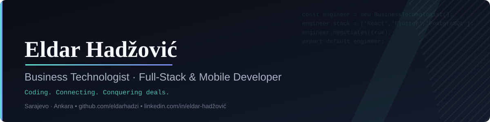

<div align="center">
  
</div>

<br/>

### Who am I?

```js
const eldar = {
  role: "Mobile Application Developer @ Promet Bilgi Sistemleri",
  base: ["Sarajevo, BA", "Ankara, TR"],
  currentlyLearning: "AI-assisted product development",
  background: ["Full-stack dev", "Business development", "Negotiation"],
  philosophy: "Coding. Connecting. Conquering deals."
};
```

I'm a full-stack / mobile developer who also closes deals — co-founded a software
agency (8+ client projects, 95% retention), then moved into production Flutter
development at scale. I like the parts of building software that most engineers
skip: scoping the client conversation, negotiating the contract, and shipping the
thing on time.

### Currently

- 🔭 Building production Flutter apps used by 1,000+ end users
- 🌱 Sharpening full-stack architecture (React, Flutter, PostgreSQL)
- 🤝 Previously repped an AI startup (DAKAEi AI) to 50+ prospects
- 🏆 1st place, Bosnia Bank International Negotiation League

<br/>

### Programming Languages


### Frameworks and Libraries


### Databases and Cloud Hosting


### Software and Tools


<br/>

### Connect with Me

<div align="center">

[](https://www.linkedin.com/in/eldar-had%C5%BEovi%C4%87-1375a925b/)
[](https://github.com/eldarhadzi)
[](https://eldar-hadzovic-cv.vercel.app)
[](mailto:eldarhadzovic03@gmail.com)

</div>

<br/>

<div align="center"> 
   
   </div>


